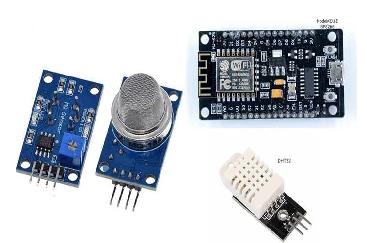
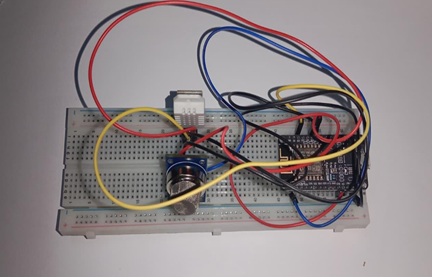
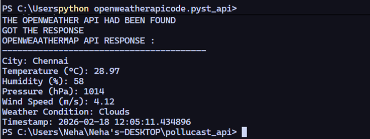
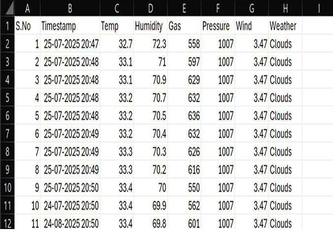
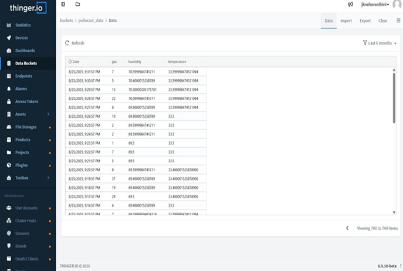
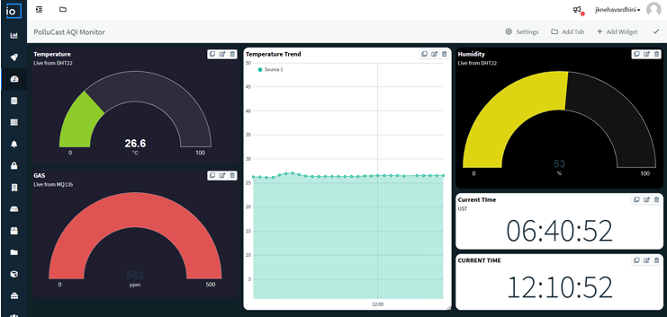
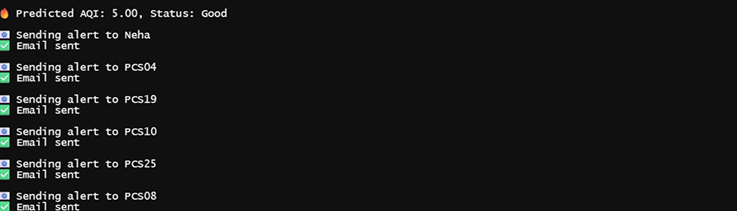
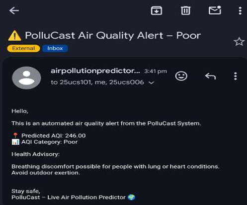
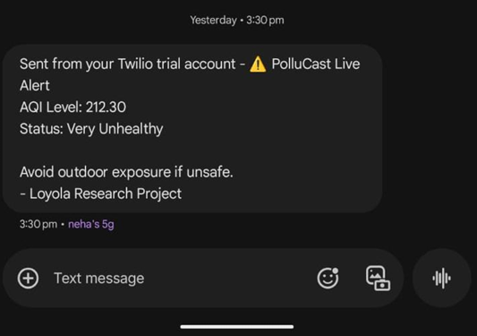
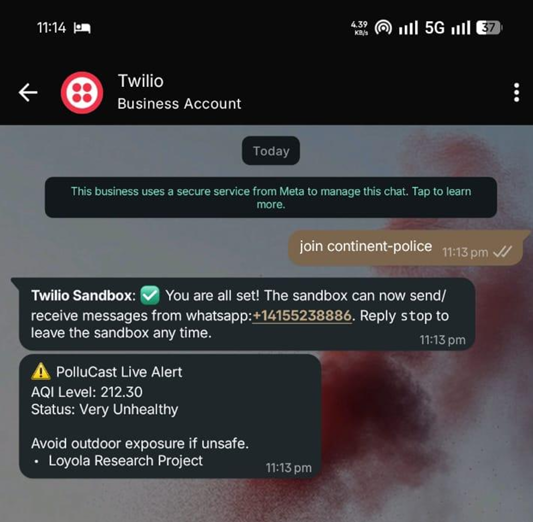

<div align="center">

[](https://git.io/typing-svg)


<br/>


> **An end-to-end IoT + Machine Learning system** that monitors air quality in real time, predicts AQI using ML models, and automatically dispatches health alerts via SMS, WhatsApp, and Email when pollution crosses unsafe thresholds.

</div>

---

## 📑 Table of Contents

- [Overview](#-overview)
- [System Architecture](#-system-architecture)
- [Features](#-features)
- [Tech Stack](#-tech-stack)
- [Project Structure](#-project-structure)
- [How It Works](#-how-it-works)
- [IoT Hardware Setup](#-iot-hardware-setup)
- [Cloud Dashboard](#-cloud-dashboard)
- [ML Model Performance](#-ml-model-performance)
- [AQI Classification](#-aqi-classification)
- [Alert System](#-alert-system)
- [Results Gallery](#-results-gallery)
- [Setup & Usage](#-setup--usage)
- [Security](#-security)
- [Future Work](#-future-work)
- [Author](#-author)

---

## 🌍 Overview

**PolluCast** is a full-stack air quality monitoring solution that bridges hardware sensing, cloud data pipelines, and machine learning to deliver actionable pollution insights.

It uses an **MQ135 gas sensor** and **DHT22 temperature/humidity sensor** connected to a **NodeMCU ESP8266**, feeds live readings into a cloud dashboard (Thinger.io), runs an ML model to predict AQI, and automatically dispatches health alerts when pollution crosses unsafe thresholds.

---

## 🏗️ System Architecture

```
┌─────────────────────────────────────────────────────────────────┐
│                     HARDWARE LAYER                              │
│   MQ135 Gas Sensor  +  DHT22 Temp/Humidity Sensor              │
└───────────────────────────┬─────────────────────────────────────┘
                            │
                            ▼
┌─────────────────────────────────────────────────────────────────┐
│                   NodeMCU ESP8266                               │
│              Data Collection & WiFi Transmission                │
└───────────────────────────┬─────────────────────────────────────┘
                            │
                            ▼
┌─────────────────────────────────────────────────────────────────┐
│               Cloud Platform — Thinger.io                       │
│         Real-time Visualization · Bucket Storage · API          │
└───────────────────────────┬─────────────────────────────────────┘
                            │
                            ▼
┌─────────────────────────────────────────────────────────────────┐
│              Python ML Pipeline                                 │
│   Preprocessing → Feature Engineering → AQI Prediction         │
│   Random Forest  /  Gradient Boosting                          │
└───────────────────────────┬─────────────────────────────────────┘
                            │
                            ▼
┌─────────────────────────────────────────────────────────────────┐
│                    Alert Engine                                 │
│         SMS (Twilio) · WhatsApp (Twilio) · Email (SMTP)        │
└─────────────────────────────────────────────────────────────────┘
```

---

## ✨ Features

| Feature | Description |
|:---|:---|
| 📡 **Real-Time Sensing** | MQ135 + DHT22 sensors capture gas, temperature & humidity live |
| 🤖 **ML AQI Prediction** | Random Forest & Gradient Boosting models predict AQI from sensor data |
| 🚨 **Multi-Channel Alerts** | Automated SMS, WhatsApp & Email alerts on threshold breach |
| ☁️ **Cloud Dashboard** | Live data visualization and bucket storage on Thinger.io |
| 📊 **WHO-Standard Classification** | AQI mapped across 6 health risk categories |
| 🔐 **Secure Credential Management** | API keys managed via `.env` — never committed |
| 📈 **Model Comparison** | Side-by-side performance metrics for both ML approaches |

---

## 🛠️ Tech Stack

| Category | Tools / Libraries |
|:---|:---|
| Language | Python 3.10 |
| Data Processing | Pandas, NumPy |
| Machine Learning | Scikit-learn — Random Forest, Gradient Boosting |
| Alerts | Twilio API (SMS & WhatsApp), SMTP (Gmail) |
| IoT Hardware | MQ135 Gas Sensor, DHT22, NodeMCU ESP8266 |
| Cloud Platform | Thinger.io |
| Environment | python-dotenv |

---

## 📁 Project Structure

```
air-pollution-predictor/
│
├── 1AQI/
│   ├── codingfiles/          # Data collection, preprocessing, feature engineering
│   ├── datasets/             # Raw and processed air quality data
│   ├── modelsrfgb/           # Trained ML model files (.pkl)
│   ├── alerts/               # SMS, WhatsApp, and Email alert scripts
│   └── results/              # Output visuals, graphs & screenshots
│       ├── IoT_Sensor_Components.png
│       ├── Iot_Sensors_Hardware_Setup.png
│       ├── Sensor_Data_Output.png
│       ├── Cloud_Thinger.io_Buckets.png
│       ├── Cloud_Thinger.io_Data_Readings.png
│       ├── Cloud_Thinger.io_Visualization.png
│       ├── AQI_Calculation(formula).png
│       ├── AQI_Max(formula).png
│       ├── AQI_prediction_ML_models.png
│       ├── AQI_Email_Alert.png
│       ├── AQI_SMS_Alert.png
│       └── AQI_Whatsapp_Alert.png
│
├── .env.example              # Template for API keys & credentials
├── requirements.txt          # Python dependencies
└── README.md
```

---

## ⚙️ How It Works

```
STEP 1 — SENSE
  MQ135 + DHT22 sensors capture CO₂, temperature & humidity in real time
  via NodeMCU ESP8266.
  
STEP 2 — UPLOAD
  NodeMCU transmits readings to Thinger.io cloud over WiFi for live
  monitoring and persistent storage in data buckets.

STEP 3 — PREPROCESS
  Python scripts pull data, clean it, handle missing values,
  and engineer features for model input.

STEP 4 — PREDICT
  Trained Random Forest / Gradient Boosting model predicts the AQI value
  from the processed sensor features.

STEP 5 — CLASSIFY
  Predicted AQI is mapped to a WHO health category (Good → Hazardous).

STEP 6 — ALERT
  If AQI exceeds the safe threshold, the alert engine fires automatically —
  sending health warnings via SMS, WhatsApp, and Email.
```

---

## 🔧 IoT Hardware Setup

The physical layer consists of two sensors connected to a NodeMCU ESP8266 microcontroller:

**Components Used**

| Component | Role |
|:---|:---|
| MQ135 Gas Sensor | Detects CO₂, smoke, NH₃, and other harmful gases |
| DHT22 Sensor | Measures ambient temperature and humidity |
| NodeMCU ESP8266 | Microcontroller with built-in WiFi for cloud transmission |

### Sensor Components


### Hardware Assembly


### Sensor Data Output (Serial Monitor)


---

## ☁️ Cloud Dashboard — Thinger.io

Live sensor data is pushed to Thinger.io, where it is stored in data buckets and visualized in real time.

### Data Buckets


### Live Data Readings


### Real-Time Visualization


---

## 🤖 ML Model Performance

Two models were trained and evaluated for AQI prediction:

| Model | Strengths |
|:---|:---|
| **Random Forest** | Ensemble of decision trees — robust to noise and overfitting |
| **Gradient Boosting** | Sequential boosting — high accuracy on structured tabular data |

### AQI Calculation Formula
.png)

### AQI Max Formula
.png)

### Model Comparison & Results


---

## 📊 AQI Classification

| AQI Range | Category | Health Implication |
|:---:|:---|:---|
| 0 – 50 | 🟢 **Good** | Air quality is satisfactory |
| 51 – 100 | 🟡 **Moderate** | Acceptable; some risk for sensitive groups |
| 101 – 150 | 🟠 **Unhealthy for Sensitive Groups** | Sensitive individuals may experience effects |
| 151 – 200 | 🔴 **Unhealthy** | Everyone may begin to experience effects |
| 201 – 300 | 🟣 **Very Unhealthy** | Health alert — serious effects for all |
| 301+ | ⚫ **Hazardous** | Emergency conditions; entire population affected |

> Standards based on [WHO Air Quality Guidelines](https://www.who.int/news-room/fact-sheets/detail/ambient-(outdoor)-air-quality-and-health).

---

## 🚨 Alert System

Alerts are automatically triggered when AQI exceeds the defined safe threshold.

| Channel | Tool | Trigger Condition |
|:---|:---|:---|
| 📱 SMS | Twilio SMS API | AQI > threshold |
| 💬 WhatsApp | Twilio WhatsApp API | AQI > threshold |
| 📧 Email | SMTP (Gmail) | AQI > threshold |

### Email Alert


### SMS Alert


### WhatsApp Alert


---

## 🖼️ Results Gallery

| Output | File |
|:---|:---|
| 🔧 Sensor Components | `results/IoT_Sensor_Components.png` |
| 🔌 Hardware Setup | `results/Iot_Sensors_Hardware_Setup.png` |
| 📟 Sensor Data Output | `results/Sensor_Data_Output.png` |
| ☁️ Thinger.io Buckets | `results/Cloud_Thinger.io_Buckets.png` |
| 📈 Cloud Data Readings | `results/Cloud_Thinger.io_Data_Readings.png` |
| 📊 Cloud Visualization | `results/Cloud_Thinger.io_Visualization.png` |
| 🧮 AQI Formula | `results/AQI_Calculation(formula).png` |
| 📐 AQI Max Formula | `results/AQI_Max(formula).png` |
| 🤖 ML Model Results | `results/AQI_prediction_ML_models.png` |
| 📧 Email Alert | `results/AQI_Email_Alert.png` |
| 📱 SMS Alert | `results/AQI_SMS_Alert.png` |
| 💬 WhatsApp Alert | `results/AQI_Whatsapp_Alert.png` |

---

## 🚀 Setup & Usage

### 1. Clone the repository
```bash
git clone https://github.com/jk-neha/air-pollution-predictor-with-real-time-health-alerts.git
cd air-pollution-predictor-with-real-time-health-alerts
```

### 2. Install dependencies
```bash
pip install -r requirements.txt
```

### 3. Configure credentials
```bash
cp .env.example .env
# Open .env and fill in:
# - TWILIO_ACCOUNT_SID
# - TWILIO_AUTH_TOKEN
# - TWILIO_FROM_NUMBER / WHATSAPP_FROM
# - ALERT_TO_NUMBER / ALERT_TO_EMAIL
# - SMTP_USER / SMTP_PASSWORD
```

### 4. Run the pipeline
```bash
# Step 1 — Preprocess sensor data
python 1AQI/codingfiles/preprocess.py

# Step 2 — Predict AQI using trained ML model
python 1AQI/codingfiles/predict_aqi.py

# Step 3 — Run multi-channel alert system
python 1AQI/alerts/send_alerts.py
```

---

## 🔐 Security

All API keys, credentials, and tokens are managed via a `.env` file and are **never committed to the repository**.

A `.env.example` template is provided with placeholder values. **Never share your actual `.env` file.**

---

## 🔮 Future Work

- [ ] Deploy as a live REST API using FastAPI
- [ ] Build a mobile-friendly real-time dashboard
- [ ] Improve prediction accuracy with LSTM / deep learning models
- [ ] Add geographic pollution map visualization
- [ ] Docker containerization for easy deployment
- [ ] Support for additional sensors (PM2.5, NO₂, O₃)

---

## 👩‍💻 Author

**Neha* Vardhini J K* · [@jk-neha](https://github.com/jk-neha)

> *PostGraduate Project [Loyola College] — Air Pollution Predictor with health alert*

---

<div align="center">

*⭐ If this project was useful or interesting, consider giving it a star — it helps others discover it.*

</div>
